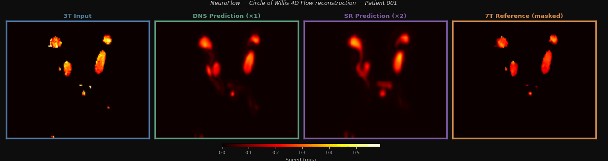
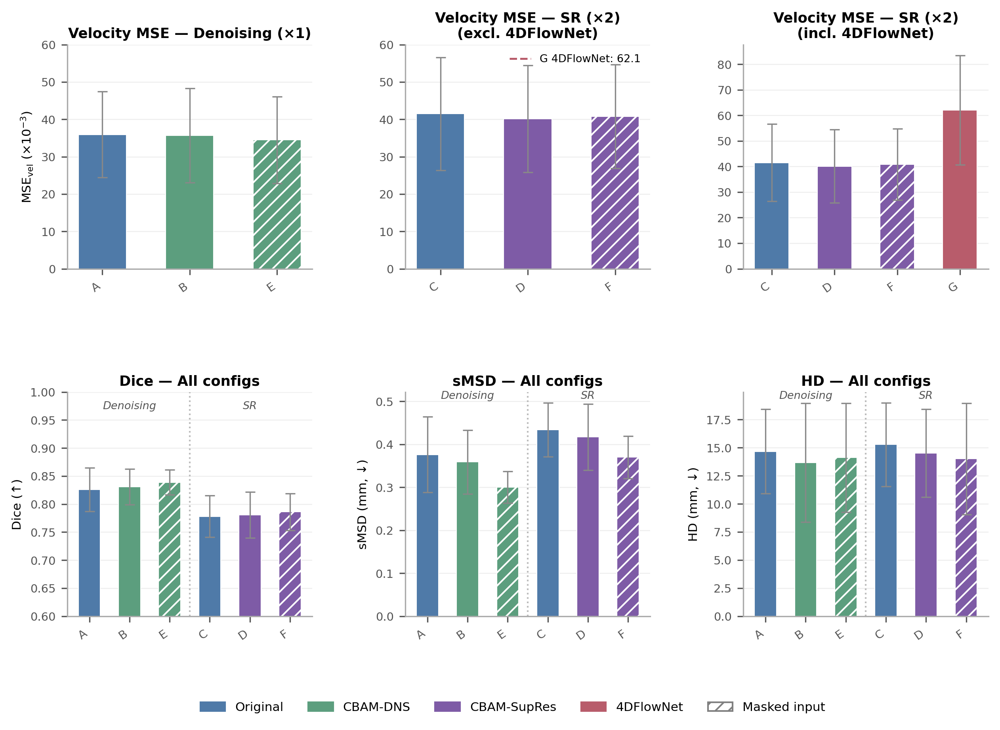
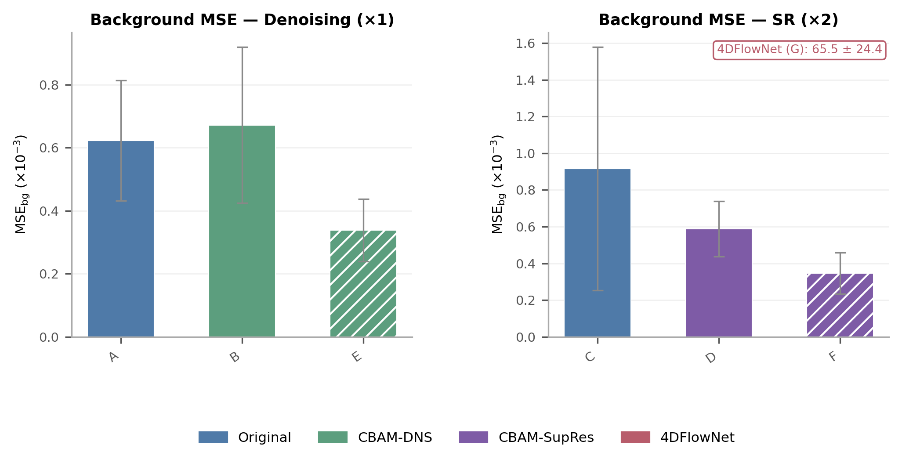
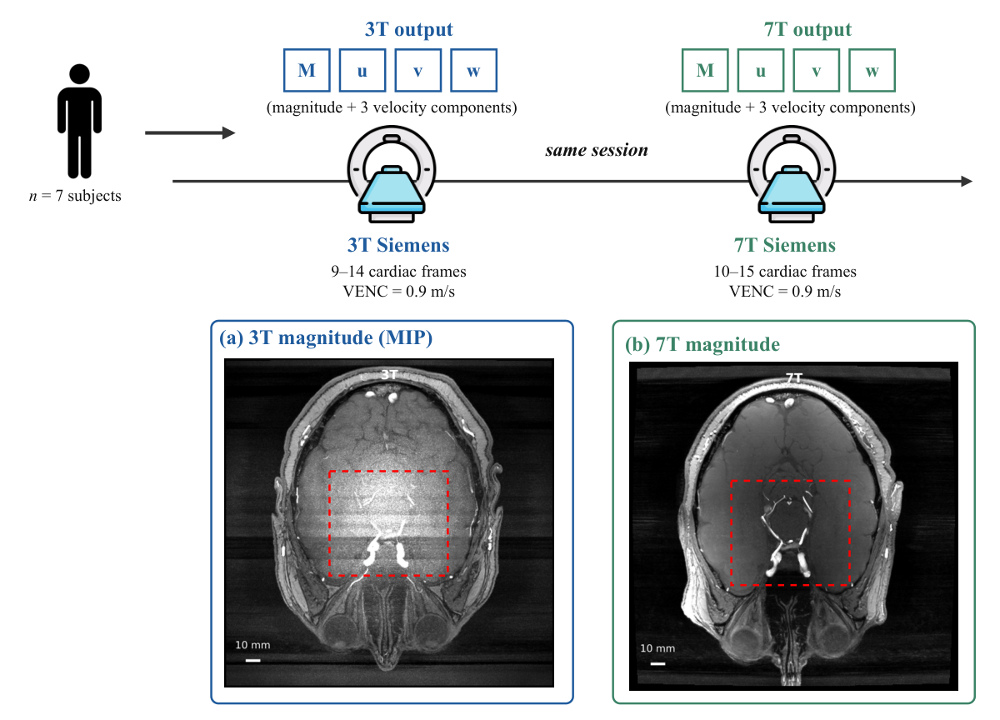
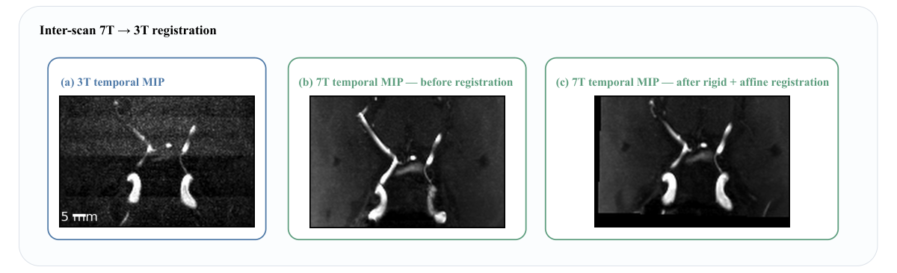
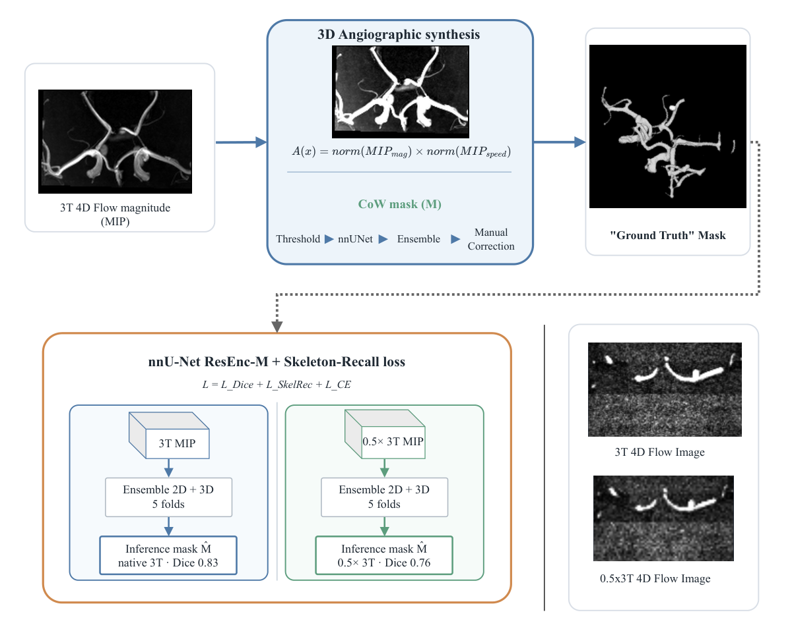
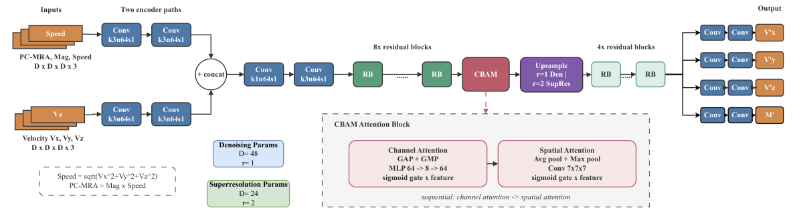
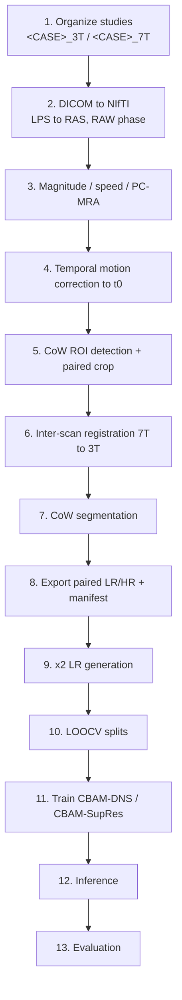

# NeuroFlow

**Joint 3T → 7T domain translation and super-resolution of cerebrovascular 4D Flow MRI.**

Ultra-high-field 7T 4D Flow MRI resolves the Circle of Willis with a
signal-to-noise ratio and spatial detail that clinical 3T systems cannot reach,
but 7T scanners are rare. NeuroFlow learns the 3T → 7T mapping directly from
paired acquisitions of the same subjects, acquired in a single session on both
scanners, and applies it to clinical 3T data. Two task-specific models are
released:

- **CBAM-DNS** (×1) — same-resolution domain translation: 3T input, 7T-quality output.
- **CBAM-SupRes** (×2) — joint domain translation and 2× super-resolution.

Both extend the SR4DFlowNet residual architecture with a CBAM attention block
placed before upsampling. The repository contains the complete pipeline: DICOM
conversion, motion correction, Circle-of-Willis detection and segmentation,
paired-dataset construction, training, inference, and the evaluation code behind
every table in the manuscript.

<p align="center">
  
</p>

---

## Key results

Leave-one-out cross-validation, n = 7 subjects, mean ± SD, VENC = 0.9 m/s.
Intraluminal velocity MSE, ×10⁻³ (lower is better).

| Task | Model | Input | Total MSE ↓ |
| --- | --- | --- | --- |
| Denoising (×1) | Original baseline | Synthetic noise | 35.9 ± 11.5 |
| Denoising (×1) | **CBAM-DNS** | **Masked** | **34.5 ± 11.6** |
| Super-resolution (×2) | Original baseline | Synthetic noise | 41.5 ± 15.1 |
| Super-resolution (×2) | **CBAM-SupRes** | Synthetic noise | **40.1 ± 14.3** |
| Super-resolution (×2) | Stock 4DFlowNet | Original | 62.1 ± 21.4 |

CBAM-DNS with masked input improves on the Original baseline by 3.9%.
CBAM-SupRes reduces error by 35% relative to stock 4DFlowNet at ×2.

<p align="center">
  
  
</p>

---

## Method overview

<p align="center"></p>

**1. Acquisition and pairing.** Each subject is scanned on a clinical 3T and an
investigational 7T system in the same session. Cardiac frames are paired across
scanners by nearest normalised trigger time.

<p align="center"></p>

**2. Motion correction and registration.** Rigid intra-scan correction aligns
every cardiac frame to t₀; a rigid + affine inter-scan step brings the 7T volume
into the 3T frame so that voxels correspond.

<p align="center"></p>

**3. Angiographic synthesis and vascular masking.** A PC-MRA volume is
synthesised from magnitude and speed, then segmented with a TopCoW nnU-Net
ensemble and manually corrected to give the Circle-of-Willis mask that defines
the intraluminal loss region.

<p align="center"></p>

**4. Architecture.** Two encoder paths (speed/PC-MRA/magnitude and velocity)
feed a residual trunk. A CBAM block applies channel-then-spatial attention
before the upsampling stage — identity for CBAM-DNS (r=1), ×2 for CBAM-SupRes.

---

## Installation

```bash
git clone https://github.com/zheng-sk/NeuroFlow.git
cd NeuroFlow
python -m venv .venv && source .venv/bin/activate
pip install -e ".[viz,segmentation]"
```

Python ≥ 3.11. Install PyTorch matching your platform and CUDA build from the
official wheels first if the default index does not resolve one. Extras:
`viz` (PyVista/VTK visualisation and aneurysm geometry), `segmentation`
(nnU-Net + YOLO), `dev` (pytest, pymupdf).

This installs four console entry points, so no command needs `cd` or a
`PYTHONPATH`:

```
neuroflow-dicom2nifti   neuroflow-train   neuroflow-predict   neuroflow-segment-cow
```

Every other module runs as `python -m neuroflow.<subpackage>.<module>`.

### External model weights

`models/` is not tracked. Populate it before running the segmentation or
inference stages:

| Path | What | Where from |
| --- | --- | --- |
| `models/topcow-claim-models/` | nnU-Net CoW segmentation ensemble (5 folds) | [TopCoW challenge](https://topcow23.grand-challenge.org/) |
| `models/yolo-cow-detection.pt` | YOLO Circle-of-Willis ROI detector | trained in-house; available on request |
| `models/<experiment>/…` | NeuroFlow LOOCV checkpoints | available on request |

---

## Pipeline

Each stage lists its inputs, the command, its outputs, and a QC check.
Stage-by-stage detail lives in [`docs/`](docs/README.md).



| # | Stage | Entry point |
| --- | --- | --- |
| 1 | Organize studies | convention only |
| 2 | DICOM → NIfTI | `neuroflow-dicom2nifti` |
| 3 | Magnitude / speed / PC-MRA | `neuroflow.preprocessing.calculate_mag` |
| 4 | Temporal motion correction | `neuroflow.registration.batch_register_magnitude` |
| 5 | CoW ROI detection + paired crop | `neuroflow.preprocessing.yolo_crop_patient_pairs` |
| 6 | Inter-scan registration 7T → 3T | `neuroflow.registration.batch_register_7T_to_3T` |
| 7 | CoW segmentation | `neuroflow-segment-cow` |
| 8 | Export paired dataset | `neuroflow.registration.export_paired_lr_hr_dataset` |
| 9 | ×2 LR generation | `neuroflow.preprocessing.downsample_nifti_tree` |
| 10 | LOOCV splits | `neuroflow.registration.generate_loo_cv_csv` |
| 11 | Training | `scripts/run_loo_xval.sh` |
| 12 | Inference | `neuroflow-predict` |
| 13 | Evaluation | `scripts/run_xval_eval.sh` |

### 1. Organize studies

Two directories per subject, distinguished by field-strength suffix:

```
data/sorted_patients/
  subject_001_3T/
  subject_001_7T/
```

### 2. DICOM → NIfTI

Converts RAW phase without rescaling and applies the LPS → RAS sign convention,
so velocity components keep their physical orientation.

```bash
neuroflow-dicom2nifti \
  --input-root data/sorted_patients \
  --output-root data/nifti_patients \
  --canonicalize
```

*QC:* phase volumes should be centred near 2048 (unsigned RAW) or 0 (signed).
Check with `python -m neuroflow.registration.check_phase_ranges`.

### 3. Magnitude, speed, and PC-MRA

```bash
python -m neuroflow.preprocessing.calculate_mag \
  --input-dir data/nifti_patients \
  --output-dir data/nifti_patients
```

*QC:* the PC-MRA maximum-intensity projection should show the Circle of Willis
clearly against suppressed static tissue.

### 4. Temporal motion correction

Rigid-body alignment of every cardiac frame to t₀, estimated on magnitude by
normalised mutual information and applied to the paired velocity volumes.

```bash
python -m neuroflow.registration.batch_register_magnitude \
  --input-dir data/nifti_patients \
  --output-dir data/temporal_registered \
  --reg-type Rigid
```

*QC:* per-frame NCC against t₀ should rise after correction.

### 5. CoW ROI detection and paired crop

A YOLO detector localises the Circle of Willis per slice; the median box defines
one crop applied identically to the 3T and 7T volumes.

```bash
python -m neuroflow.preprocessing.yolo_crop_patient_pairs \
  --input-dir data/temporal_registered \
  --output-dir data/temporal_registered_cow_crop \
  --yolo-model models/yolo-cow-detection.pt \
  --fixed-suffix _3T --moving-suffix _7T
```

*QC:* both crops must have identical shape and cover the full vessel extent —
verify the left-right extent in particular.

### 6. Inter-scan registration 7T → 3T

```bash
python -m neuroflow.registration.batch_register_7T_to_3T \
  --input-dir data/temporal_registered_cow_crop \
  --output-dir data/registered_7T_in_3T_cow_crop \
  --mask-method none \
  --phase-warp-mode direct \
  --interpolator-phase nearestNeighbor
```

Phase volumes use nearest-neighbour interpolation to avoid blending across
aliasing wraps.

*QC:* a checkerboard overlay of the registered 7T magnitude on 3T should show
continuous vessels across tile boundaries.

### 7. Circle-of-Willis segmentation

nnU-Net ensemble on the temporal projection, optionally unioned with a classical
vesselness response.

```bash
neuroflow-segment-cow \
  --input data/registered_7T_in_3T_cow_crop \
  --recursive \
  --model-dir models/topcow-claim-models \
  --output-dir data/cow_segmentation
```

*QC:* Dice against manually corrected masks was 0.83 at native 3T and 0.76 at
0.5× 3T. Inspect and correct before using a mask as a loss region.

### 8. Export the paired dataset and manifest

```bash
python -m neuroflow.registration.export_paired_lr_hr_dataset \
  --temporal-dir data/temporal_registered_cow_crop \
  --registered-dir data/registered_7T_in_3T_cow_crop \
  --output-root data/paired_dataset
```

Produces `lr_3t/`, `hr_7t_in_3t/`, and the case manifest. Frames are paired by
nearest normalised trigger time; see
[`examples/manifest_template.csv`](examples/manifest_template.csv).

*QC:* `time_end` must equal the number of usable LR frames, and
`hr_time_index_map` must have exactly that many entries.

### 9. ×2 low-resolution generation

```bash
python -m neuroflow.preprocessing.downsample_nifti_tree \
  --input-root data/paired_dataset/lr_3t \
  --output-root data/paired_dataset/lr_3t_x05 \
  --scale 0.5 --time-axis -1

python -m neuroflow.preprocessing.remap_case_csv_for_x2 \
  --in-csv  data/paired_dataset/cases.csv \
  --out-csv data/paired_dataset/cases_x2.csv \
  --mode lr_from_lr \
  --source-root  data/paired_dataset/lr_3t \
  --new-lr-root  data/paired_dataset/lr_3t_x05
```

### 10. Patient-level LOOCV splits

```bash
python -m neuroflow.registration.generate_loo_cv_csv \
  --csv-in  data/paired_dataset/cases.csv \
  --out-dir data/paired_dataset/loo_trainval_hrmasked_r1 \
  --train-val-only
```

Splits are held out **by patient**, never by frame, so no subject appears in
both train and validation.

### 11. Training

```bash
XVAL_EXPERIMENT_NAME=my_run bash scripts/run_loo_xval.sh
```

Manuscript settings, from [`scripts/run_loo_xval.sh`](scripts/run_loo_xval.sh):

| Setting | ×1 (CBAM-DNS) | ×2 (CBAM-SupRes) |
| --- | --- | --- |
| `MODEL_VARIANT` | `pre_upsample_attention` | `pre_upsample_attention` |
| LR patch size | 48 | 24 |
| `res-increase` | 1 | 2 |
| Batch size | 8 | 8 |
| Epochs | 500 | 500 |
| Seed | 42 (`--deterministic`) | 42 (`--deterministic`) |
| Non-fluid loss weight | 0.3 | 0.3 |
| Noise augmentation | `--noise-aug-prob 0.8`, masked fraction 0.1 | same |
| Early stopping | patience 80 | patience 80 |

Two input strategies, matching the manuscript:

```bash
# Synthetic-noise input (configs A-D, G) - the default
XVAL_EXPERIMENT_NAME=synth bash scripts/run_loo_xval.sh

# Masked input (configs E, F)
XVAL_EXPERIMENT_NAME=masked \
  APPLY_MASK_TO_LR_INPUTS=1 APPLY_MASK_TO_LR_MAGNITUDE=1 \
  bash scripts/run_loo_xval.sh
```

`MODE=denoise|sr|both` selects the task; `GPU_DENOISE` / `GPU_SR` pin devices.

### 12. Inference

```bash
neuroflow-predict \
  --u  path/lr_u.nii.gz  --v path/lr_v.nii.gz  --w path/lr_w.nii.gz \
  --mag-u path/lr_mag_u.nii.gz --mag-v path/lr_mag_v.nii.gz --mag-w path/lr_mag_w.nii.gz \
  --model-path models/my_run/r1_noise/fold_000_.../model-best.pt \
  --output-prefix output/pred \
  --patch-size 48 --res-increase 1
```

MONAI sliding-window with 25% overlap. `--legacy-overlap-inference` switches to
the original patch/trim reconstruction.

### 13. Evaluation

```bash
bash scripts/run_xval_eval.sh          # inference + velocity/background/geometry
bash scripts/run_geometry_only.sh      # geometry only, for missing folds
bash scripts/run_sr_uq_reports.sh      # per-case uncertainty reports
```

Fold names are discovered from the split directories, so these run against your
own cohort without editing. Geometry metrics re-segment each prediction with the
TopCoW pipeline and compare against the subject-specific 7T reference mask.

---

## Data manifest format

One case per row, 23 columns. See
[`examples/manifest_template.csv`](examples/manifest_template.csv).

| Group | Columns |
| --- | --- |
| LR velocity | `lr_u`, `lr_v`, `lr_w` |
| LR magnitude | `lr_mag_u`, `lr_mag_v`, `lr_mag_w` |
| HR velocity | `hr_u`, `hr_v`, `hr_w` |
| HR magnitude | `hr_mag` |
| Loss region | `mask` |
| Velocity encoding | `venc`, `venc_u`, `venc_v`, `venc_w` |
| Frame range | `time_start`, `time_end`, `time_index` |
| Frame pairing | `lr_time_index`, `hr_time_index`, `lr_trigger_time_ms`, `hr_trigger_time_ms`, `pairing_method` |

Paths may be absolute or relative to the CSV. `mask` may be empty, in which case
the full volume is used. `venc` ≤ 0 is estimated from the LR velocity maximum.

---

## Repository layout

```
neuroflow/            Installable package
  conversion/         DICOM to NIfTI
  preprocessing/      Magnitude/speed/PC-MRA, YOLO ROI crop, x2 downsampling
  registration/       Temporal and inter-scan registration, dataset export, LOOCV splits
  segmentation/       Circle-of-Willis segmentation (nnU-Net + vesselness)
  models/             SR4DFlowNet variants, CBAM blocks, model factory, losses
  data/               NIfTI dataset, patch sampling, manifest generation
  training/           Trainer and training CLI
  inference/          Prediction and SR-UQ pipelines
  evaluation/         Velocity, background, geometry, and aneurysm metrics
  visualization/      PyVista/flow visualisation and interactive ROI pickers
scripts/              The five reproducibility scripts
docs/                 Stage-by-stage documentation
examples/             Manifest template
patches/              nnU-Net patch needed only to retrain segmentation
assets/               README figures
tests/                Unit tests
```

---

## Reproducing the manuscript

Configurations reported in the main text:

| ID | Task | Architecture | Input | How to run |
| --- | --- | --- | --- | --- |
| A | ×1 | Original | Synthetic noise | `MODE=denoise MODEL_VARIANT=original bash scripts/run_loo_xval.sh` |
| B | ×1 | CBAM-DNS | Synthetic noise | `MODE=denoise bash scripts/run_loo_xval.sh` |
| E | ×1 | CBAM-DNS | Masked | `MODE=denoise APPLY_MASK_TO_LR_INPUTS=1 bash scripts/run_loo_xval.sh` |
| C | ×2 | Original | Synthetic noise | `MODE=sr MODEL_VARIANT=original bash scripts/run_loo_xval.sh` |
| D | ×2 | CBAM-SupRes | Synthetic noise | `MODE=sr bash scripts/run_loo_xval.sh` |
| F | ×2 | CBAM-SupRes | Masked | `MODE=sr APPLY_MASK_TO_LR_INPUTS=1 bash scripts/run_loo_xval.sh` |
| G | ×2 | Stock 4DFlowNet | Original | pretrained 4DFlowNet weights, no retraining |

Then `bash scripts/run_xval_eval.sh` with a matching `XVAL_EXPERIMENT_NAME`.

**Supplementary ablations.** The cascade, phase-attention, and JiT-SR
architectures referenced as supplementary material are **not** on `main`. They
are preserved in full on the **`neuroflow_dev`** branch, together with the
manuscript sources, the exploratory notebooks, and the legacy HDF5 workflow:

```bash
git checkout neuroflow_dev
```

---

## Data availability

The paired 3T/7T cohort is **not** redistributed with this repository. The data
are human subject acquisitions and cannot be shared publicly. Case identifiers
used internally embed acquisition dates and have been removed here.

Researchers who wish to reproduce the results on the original cohort should
contact the authors; access is subject to the governing ethics approval and a
data-sharing agreement. The full pipeline runs on any paired 4D Flow dataset
that can be expressed in the manifest format above.

---

## Citation

See [`CITATION.cff`](CITATION.cff).

```bibtex
@software{neuroflow2026,
  title  = {{NeuroFlow}: joint 3T-to-7T domain translation and super-resolution
            of cerebrovascular 4D Flow MRI},
  year   = {2026},
  url    = {https://github.com/zheng-sk/NeuroFlow},
  license = {MIT}
}
```

If you use NeuroFlow, please also cite 4DFlowNet, from which it derives:

```bibtex
@article{ferdian2020,
  title   = {{4DFlowNet}: Super-Resolution {4D} Flow {MRI} Using Deep Learning
             and Computational Fluid Dynamics},
  author  = {Ferdian, Edward and Suinesiaputra, Avan and Dubowitz, David J. and
             Zhao, Debbie and Wang, Alan and Cowan, Brett and Young, Alistair A.},
  journal = {Frontiers in Physics},
  volume  = {8},
  pages   = {138},
  year    = {2020},
  doi     = {10.3389/fphy.2020.00138}
}
```

---

## Acknowledgements

NeuroFlow builds on **4DFlowNet** by Edward Ferdian and colleagues (MIT,
Copyright © 2020 Edward Ferdian), **nnU-Net v2** by Isensee et al. (Apache-2.0),
segmentation models from the **TopCoW** challenge, and **MONAI**. Full
attribution is in [`NOTICE`](NOTICE).

## License

MIT — see [`LICENSE`](LICENSE). The original 4DFlowNet copyright notice is
retained as those terms require. Note that the optional `segmentation` extra
pulls in Ultralytics YOLO, which is AGPL-3.0; see [`NOTICE`](NOTICE).
