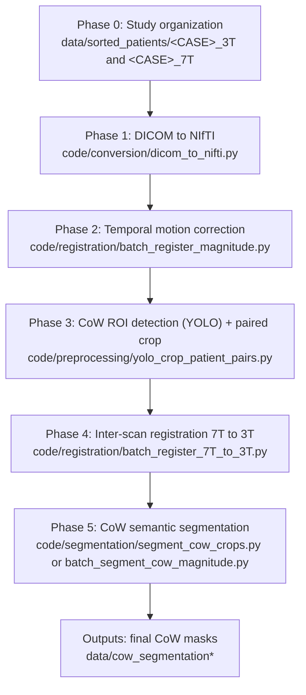

# NeuroFlow Preprocessing

This document describes the preprocessing pipeline used in this repository for Circle of Willis (CoW) workflows, from raw studies to final CoW semantic masks in registered 7T data.

Pipeline order:
1. Organize patient studies.
2. Convert DICOM to NIfTI.
3. Run temporal motion correction.
4. Detect CoW ROI with YOLO and crop.
5. Run inter-scan registration (7T -> 3T).
6. Run final CoW semantic segmentation.

## Flowchart



## Phase 0: Study Organization

Relevant files:
- `code/registration/batch_register_magnitude.py`
- `code/registration/batch_register_7T_to_3T.py`

Expected naming convention:
- `<CASE>_3T` for fixed studies.
- `<CASE>_7T` for moving studies.

Example:

```text
data/sorted_patients/
  subject_001_3T/
  subject_001_7T/
```

Key checks:
- Keep file naming consistent (`input_mag_raw.nii.gz`, `Vx.nii.gz`, `Vy.nii.gz`, `Vz.nii.gz`).
- Avoid mixing studies with different geometry inside one case folder.

## Phase 1: DICOM -> NIfTI

Main script:
- `code/conversion/dicom_to_nifti.py`

Libraries:
- `pydicom`, `nibabel`, `numpy`, `tqdm`
- `dcm2niix` via `subprocess` when available

What it does:
- Tries `dcm2niix` first.
- Falls back to direct 4D DICOM reading if needed.
- Builds/normalizes affine and qform/sform in NIfTI.
- Preserves RAW phase values (no LUT/rescale conversion).
- Applies LPS->RAS sign convention for components (`Vx` and `Vy` invert; `Vz` does not).

Important:
- Do not apply a second global `Vx/Vy` sign inversion downstream if this stage already handled it.

## Phase 2: Temporal Motion Correction (Intra-scan)

Scripts:
- `code/registration/batch_register_magnitude.py`
- `code/registration/core.py`
- `code/registration/temporal_register_to_t0.py`

Libraries:
- `antspyx` (`ants`), `numpy`, `matplotlib` (QC outputs)

What it does:
- Registers each 4D frame to a reference frame (`t0`) using magnitude.
- Propagates transforms to `Vx/Vy/Vz`.
- Uses vector transform mode for velocity (`imagetype=1`) to preserve component reorientation correctly.

QC metrics:
- MAD and NCC per frame in `QC_Registration`.

Important:
- If magnitude registration fails, transformed velocity outputs are not reliable.
- Review `qc_mad.png` and `qc_ncc.png` for each case.

## Phase 3: CoW ROI Detection with YOLO + Paired Crop

Script:
- `code/preprocessing/yolo_crop_patient_pairs.py`

Libraries:
- `ultralytics` (YOLO), `nibabel`, `numpy`

What it does:
- Runs CoW ROI detection on magnitude.
- Uses temporal MIP if magnitude is 4D.
- Builds one common enclosing bbox for both 3T and 7T studies.
- Crops all NIfTI files in both folders with the same crop box.

Important:
- This is ROI detection/cropping, not semantic segmentation.
- Current implementation keeps full Z by default and mainly constrains X/Y.

## Phase 4: Inter-scan Registration (7T -> 3T)

Scripts:
- `code/registration/batch_register_7T_to_3T.py`
- `code/registration/register_7T_to_3T_with_qc.py`

Libraries:
- `antspyx`, `numpy`, `matplotlib`
- optional `hd-bet` through `subprocess` for masking

What it does:
- Estimates transform on robust temporal references (`median_t` magnitude).
- Estimation preprocessing: N4 bias correction, Rician denoise, winsorization, optional histogram matching.
- Persists transform files.
- Applies transforms to 4D magnitude and `phaseX/Y/Z`.

Phase warp modes:
- `direct`: spatial warp only.
- `complex`: convert to real/imag, warp, reconstruct with `atan2`.

Important:
- For RAW phase preservation, use `--phase-warp-mode direct` and `--interpolator-phase nearestNeighbor`.
- Review `QC/summary.txt`, `qc_mad_per_frame.png`, and `qc_ncc_per_frame.png`.

## Phase 5: Final CoW Semantic Segmentation

Scripts:
- `code/segmentation/segment_cow_crops.py` for already cropped and registered inputs.
- `code/segmentation/batch_segment_cow_magnitude.py` for batch processing.
- `code/segmentation/segment_cow_patient_pipeline.py` when building angiography from MAG + Vx/Vy/Vz first.

Libraries:
- `torch`, `nnunetv2` (vendored in `topcow-2024-nnunet`)
- `nibabel`, `numpy`
- `scipy.ndimage` (morphology/components)
- optional `scikit-image` (Frangi/Sato branch)

What it does:
- Runs nnU-Net inference (`checkpoint_best` and `checkpoint_final`).
- Ensembles predictions and creates binary CoW masks.
- Optionally fuses with classical vesselness branch.
- Optional postprocessing: closing/opening, hole filling, small-component removal.

Important:
- Conservative setup: `--no-classic-cow --ensemble-mode ai --no-postprocess`.
- More sensitive setup: include classic branch and `union` fusion.

## Core Dependencies

Primary dependency file:
- `requirements.txt`

Main stack:
- `antspyx`, `nibabel`, `pydicom`, `numpy`, `scipy`, `matplotlib`
- `ultralytics` for CoW ROI detection
- `torch` + `nnunetv2` for semantic segmentation
- `SimpleITK` is also present and used in additional preprocessing/support scripts

## Operational Risks and Validation Checklist

Geometry checks:
- Validate shape/affine consistency between phases.
- Confirm registered 7T outputs are on the 3T grid.

Intensity checks:
- Save quantitative outputs in `float32`.
- Avoid unintended NIfTI scaling side effects during re-save when doing voxel-level comparisons.

Phase/velocity checks:
- Avoid double sign inversion of `Vx/Vy`.
- Explicitly set `time-axis` and mask frame when handling 4D masks.

QC checks:
- Do not skip temporal registration QC or inter-scan registration QC.
- Track case-level parameters (`reg_type`, interpolators, `mask_method`, `phase_warp_mode`).

## Command Summary

```bash
# 1) DICOM -> NIfTI
python code/conversion/dicom_to_nifti.py \
  --input-root data/sorted_patients \
  --output-root data/nifti_patients \
  --canonicalize

# 2) Temporal motion correction
python code/registration/batch_register_magnitude.py \
  --input-dir data/nifti_patients \
  --output-dir data/temporal_registered \
  --reg-type Rigid

# 3) YOLO CoW ROI crop
python code/preprocessing/yolo_crop_patient_pairs.py \
  --input-dir data/temporal_registered \
  --output-dir data/temporal_registered_cow_crop \
  --yolo-model models/yolo-cow-detection.pt \
  --fixed-suffix _3T \
  --moving-suffix _7T

# 4) Inter-scan registration 7T -> 3T
python code/registration/batch_register_7T_to_3T.py \
  --input-dir data/temporal_registered_cow_crop \
  --output-dir data/registered_7T_in_3T_cow_crop \
  --mask-method none \
  --phase-warp-mode direct \
  --interpolator-phase nearestNeighbor

# 5) Final CoW semantic segmentation
python code/segmentation/batch_segment_cow_magnitude.py \
  --input-root data/registered_7T_in_3T_cow_crop \
  --recursive \
  --mag-pattern "mag_7T_in_3T.nii.gz" \
  --mag-name "mag_7T_in_3T.nii.gz" \
  --vx-name "phaseX_7T_in_3T.nii.gz" \
  --vy-name "phaseY_7T_in_3T.nii.gz" \
  --vz-name "phaseZ_7T_in_3T.nii.gz" \
  --output-dir data/cow_segmentation_patient_batch \
  --ensemble-mode union
```
